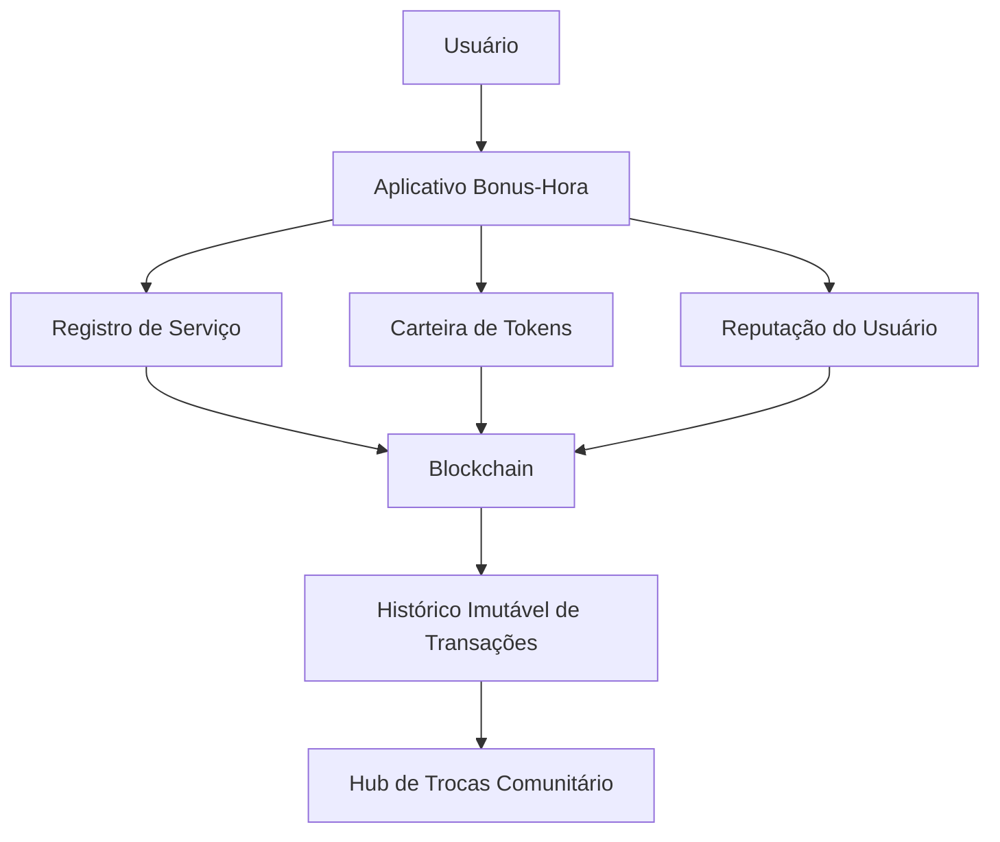

# Bonus-Hora

Bonus-Hora é uma moeda social baseada em tempo criada para facilitar trocas de serviços dentro de comunidades.

A proposta é permitir que pessoas utilizem suas habilidades para gerar valor coletivo, mesmo quando não possuem acesso a dinheiro.

No sistema Bonus-Hora:

**1 hora de serviço prestado = 1 token Bonus-Hora**

Essa abordagem fortalece economias locais e incentiva colaboração comunitária.

---

# Problema

Milhões de pessoas possuem habilidades úteis, mas muitas vezes não conseguem trocar serviços porque não têm acesso a recursos financeiros.

Isso gera três problemas principais:

- desperdício de capacidades humanas  
- baixa cooperação econômica local  
- dependência excessiva de moeda tradicional  

---

# Solução

O Bonus-Hora cria uma moeda social baseada em tempo que permite registrar e trocar serviços entre membros da comunidade.

Cada participante pode:

- oferecer serviços
- receber tokens por horas trabalhadas
- utilizar esses tokens para acessar outros serviços dentro da rede

O sistema pode funcionar em **hubs de troca comunitários** e também através de um **aplicativo digital**.

---

# Funcionalidades

O sistema Bonus-Hora inclui:

- registro de serviços prestados  
- carteira digital de tokens  
- sistema de reputação dos usuários  
- mediação de conflitos  
- governança comunitária  
- histórico transparente de transações  

---

# Tecnologias

O projeto poderá utilizar:

- blockchain
- smart contracts
- QR code para registro de serviços
- aplicativo mobile
- infraestrutura descentralizada

---

# Arquitetura do Sistema

# Roadmap do Projeto

### Fase 1 — Concepção
- definição do modelo econômico  
- documentação do projeto  
- criação do repositório GitHub  

### Fase 2 — Protótipo
- design do aplicativo  
- sistema de registro de serviços  
- carteira digital básica  

### Fase 3 — Infraestrutura Blockchain
- desenvolvimento do token Bonus-Hora  
- registro das transações  

### Fase 4 — Hub Comunitário Piloto
- implantação de um hub de trocas  
- testes com usuários reais  

### Fase 5 — Expansão
- integração com novas comunidades  
- governança descentralizada  

---

# Ecossistema

O Bonus-Hora pode evoluir para um ecossistema descentralizado composto por:

- hubs de troca comunitários  
- rede de prestadores de serviços  
- sistema de reputação baseado em blockchain  
- governança descentralizada (DAO)  

---

# Como Contribuir

O projeto Bonus-Hora é aberto à colaboração.

Desenvolvedores, pesquisadores e membros da comunidade podem contribuir com:

- desenvolvimento de software  
- design de experiência do usuário  
- estudos econômicos e sociais  
- implantação de hubs comunitários  

---

# Objetivo

Criar hubs de trocas comunitários capazes de fortalecer economias locais, estimular cooperação social e permitir que pessoas troquem valor diretamente através do tempo e do trabalho.

---

# Visão de Longo Prazo

O Bonus-Hora pretende evoluir para uma infraestrutura social descentralizada onde comunidades possam criar suas próprias economias baseadas em colaboração, confiança e troca direta de serviços.

---

# Autor

**Thales Rangel**

Criador do projeto Bonus-Hora.
