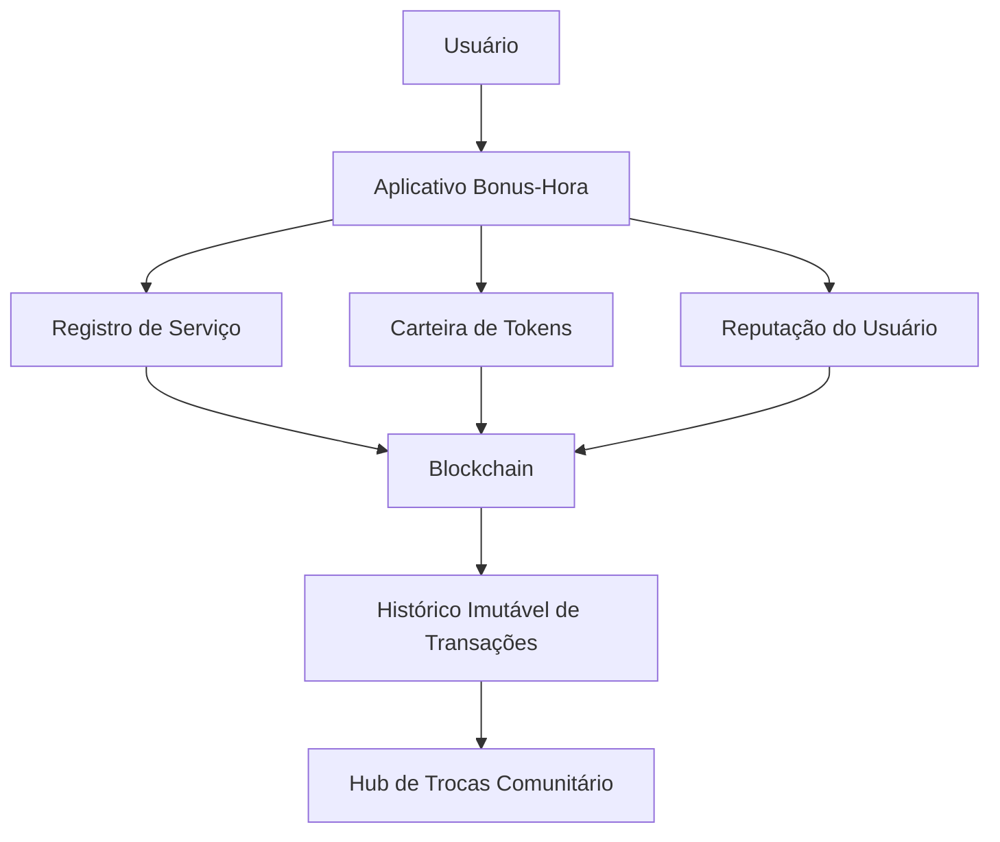
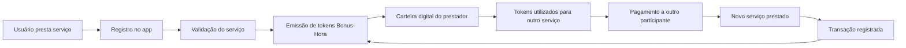

# Bonus-Hora

[](LICENSE.md) 
[](STATUS.md) 
[](TYPE.md) 
[](ECONOMIC_MODEL.md)

O whitepaper completo está em inglês, mas você pode consultar um **resumo executivo em português** nesta versão: [Resumo Executivo](RESUMO_EXECUTIVO_PT.md)

Bonus-Hora é uma moeda social baseada em tempo criada para facilitar trocas de serviços dentro de comunidades.
Bonus-Hora é uma moeda social baseada em tempo criada para facilitar trocas de serviços dentro de comunidades.

A proposta é permitir que pessoas utilizem suas habilidades para gerar valor coletivo, mesmo quando não possuem acesso a dinheiro.

No sistema Bonus-Hora:

**1 hora de serviço prestado = 1 token Bonus-Hora**

Essa abordagem fortalece economias locais e incentiva colaboração comunitária.

---

# Problema

Milhões de pessoas possuem habilidades úteis, mas muitas vezes não conseguem trocar serviços porque não têm acesso a recursos financeiros.

Isso gera três problemas principais:

- desperdício de capacidades humanas  
- baixa cooperação econômica local  
- dependência excessiva de moeda tradicional  

---

# Solução

O Bonus-Hora cria uma moeda social baseada em tempo que permite registrar e trocar serviços entre membros da comunidade.

Cada participante pode:

- oferecer serviços
- receber tokens por horas trabalhadas
- utilizar esses tokens para acessar outros serviços dentro da rede

O sistema pode funcionar em **hubs de troca comunitários** e também através de um **aplicativo digital**.

---

# Funcionalidades

O sistema Bonus-Hora inclui:

- registro de serviços prestados  
- carteira digital de tokens  
- sistema de reputação dos usuários  
- mediação de conflitos  
- governança comunitária  
- histórico transparente de transações  

---

# Tecnologias

O projeto poderá utilizar:

- blockchain
- smart contracts
- QR code para registro de serviços
- aplicativo mobile
- infraestrutura descentralizada

---

# Arquitetura do Sistema



## Roadmap do MVP (sem blockchain)

### Fase 1 — Concepção
- Definição do modelo econômico básico
- Estruturação do MVP (planilha ou app simples)

### Fase 2 — Teste Piloto
- Registro manual de serviços
- Testes com usuários reais

### Fase 3 — Validação
- Ajustes de regras de troca
- Registro de feedback e melhorias

```

# Token Flow

O ecossistema Bonus-Hora funciona como um ciclo contínuo de troca de serviços e circulação de tokens:



# Economic Model

O modelo matemático que define o sistema Bonus-Hora pode ser encontrado aqui:

[Bonus-Hora Economic Model](ECONOMIC_MODEL.md)

Este modelo define:

- Token generation rules  
- Reputation adjustments  
- Circulation balance  
- Governance mediation mechanisms  

---

# Roadmap do Projeto

## Fase 1 — Concepção
- Definição do modelo econômico  
- Documentação do projeto  
- Criação do repositório GitHub  

## Fase 2 — Protótipo
- Design do aplicativo  
- Sistema de registro de serviços  
- Carteira digital básica  

## Fase 3 — Infraestrutura Blockchain
- Desenvolvimento do token Bonus-Hora  
- Registro das transações  

## Fase 4 — Hub Comunitário Piloto
- Implantação de um hub de trocas  
- Testes com usuários reais  

## Fase 5 — Expansão
- Integração com novas comunidades  
- Governança descentralizada  

---

# Ecossistema

O Bonus-Hora pode evoluir para um ecossistema descentralizado composto por:

- Hubs de troca comunitários  
- Rede de prestadores de serviços  
- Sistema de reputação baseado em blockchain  
- Governança descentralizada (DAO)  

---

# Como Contribuir

O projeto Bonus-Hora é aberto à colaboração.  

Desenvolvedores, pesquisadores e membros da comunidade podem contribuir com:

- Desenvolvimento de software  
- Design de experiência do usuário  
- Estudos econômicos e sociais  
- Implantação de hubs comunitários  

---

# Objetivo

Criar hubs de trocas comunitários capazes de fortalecer economias locais, estimular cooperação social e permitir que pessoas troquem valor diretamente através do tempo e do trabalho.  

---

# Visão de Longo Prazo

O Bonus-Hora pretende evoluir para uma infraestrutura social descentralizada onde comunidades possam criar suas próprias economias baseadas em colaboração, confiança e troca direta de serviços.  

---

# Autor

**Thales Rangel**  
Criador do projeto Bonus-Hora.
